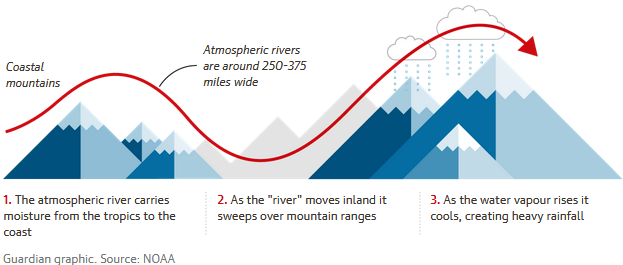
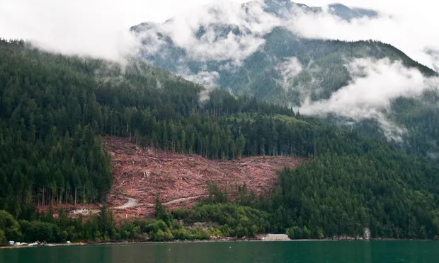
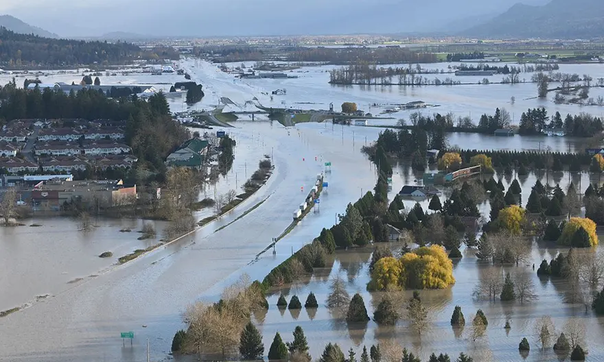
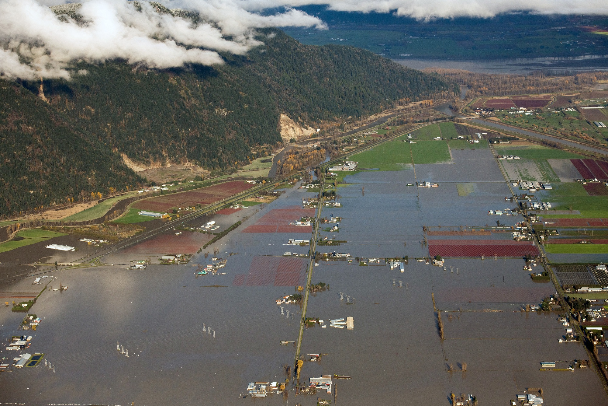

```{r setup, include=FALSE}
knitr::opts_chunk$set(echo = TRUE)
```

## Cause  

On November 14th, 2021, large storms with heavy rains descended upon the British Columbia, Canada area.  These rains severely flooded the area, and have been attributed to changing climate patterns.   


* The flood was caused by heavy rainfall which was linked to an atmospheric river, and exacerbated by a combination of hydrophobic soil from the recent wildfires, and clearcut logging.  

* Scientists who analyzed the regional heatwave that caused the wildfires found that human-caused climate change made the extreme weather at least 150 times more likely.    

* Scientists expect atmospheric rivers to form in more rapid succession and grow more intense.


   




## Impact  


* The flood has caused severe economic impacts. British Columbians are feeling the effects of supply chain issues following the floods and landslides. Gas and travel is under restriction. Thousands were evacuated, highways destroyed, entire regions flooded.  

* To tie this to agriculture: organic farms were flooded with debris and chemicals that will take years for bioremediation to relieve. Conventional farms, like organic farms, had their crops destroyed and most livestock along with them, but will not suffer the same level of inconvenience as organic farms that must meet specific criteria for their certifications.  

* This results in major setbacks in the agricultural industry of BC, both conventional and organic. Those living in BC, or those depending on food grown in BC, will feel the economic impacts which include the tax payer funded relief for both farmers and non-farmers.  

 

  

   


