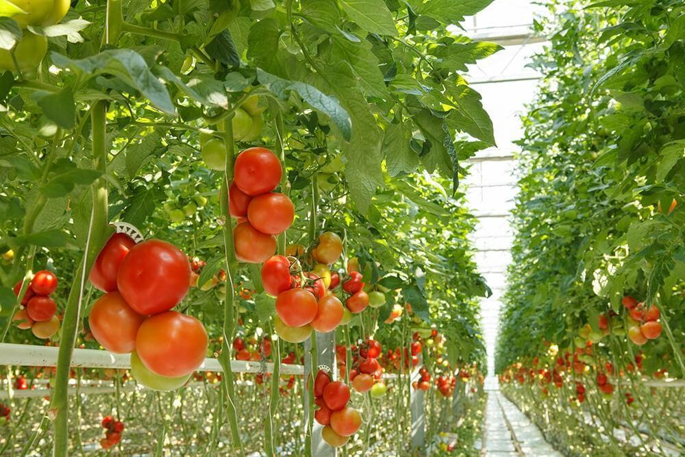
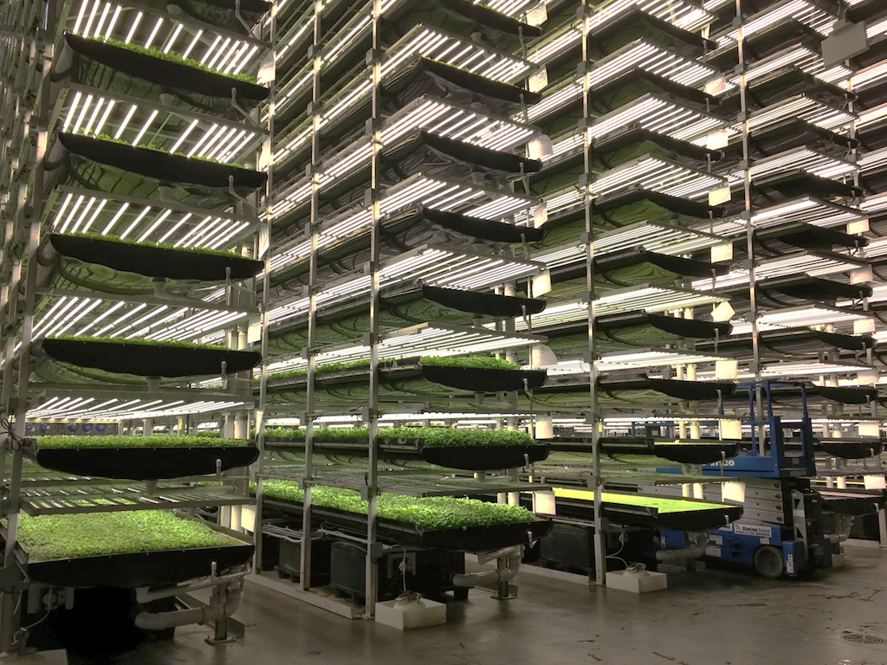

```{r setup, include=FALSE}
knitr::opts_chunk$set(echo = TRUE)
```

# Hydroponics  

  


We are faced with a rising human population and climate change. Drought, floods, and fluctuating temperatures will increase our risk of crop failures, putting food security at risk when food security is more important than ever.  Simultaneously, the world's phosphorous supply is running thin, clean water is becoming more scarce, and agricultural pollution is costly to remediate, and wasteful of our current resources due to runoff.  

* Our current method of plant production is unsustainable. We are attempting to feed the world at the cost of clean water, clean soil, habitat and biodiversity.

### What are they?  
* Hydroponics is a soilless method of agriculture which utilizes water circulation over the roots. As the plant is in contact with the water, it takes the nutrients that it needs.  

* Hydroponic technology has advanced over the years, making nutrient requirements simple to dial in. Sensors are now used to monitor the water and drip fertilizer into the reservoir as it is needed. The same sensors can adjust the pH of the water. This greatly reduces any waste of fertilizer.  

* The closed-loop system reduces loss of water, and the main loss of water is evaporation. Runoff is eliminated and the water can be recycled.  

  


### Benefits
* Hydroponics addresses many of the issues that our current mainstream methods of agriculture face. It has the ability to turn around the current unsustainable production of plants and greatly reduce pollution, while improving yields with less inputs.  

* The closed-loop cycle of hydroponic systems recirculates water rather than wastes it, making it more efficient.  

* The same system recycles nutrients, which will reduce the rate at which we consume finite phosphorous.  

  

### Cons  

* Previous arguments against hydroponics or indoor farming included the inability to produce staple foods such as wheat and potatoes.  

* These arguments were generally made years ago, and since then, hydroponics has increased in efficiency and technology. NASA now produces potatoes with hydroponics, and studies show that hydroponics can be used to produce wheat.  

* Another argument has been electricity use. Facilities often offset electricity use and costs by incorporating solar, wind, etc. There is also an increasing use of transparent building material, to allow natural light to flood into a facility and further reduce electricity needs. Energy costs of traditional farming were greatly underestimated on top of this, making energy use comparable.  

* Initial startup costs can make hydroponics seem inaccessible, but traditional farm land is rising in cost across the world and pricing out would-be farmers. Government funding is also available for indoor farming startups.   

### Types of Hydroponics  

      

* Aeroponics: Plant roots are suspended in air and misted with water and nutrients. The most popular aeroponics systems were the Aerogardens. More of an at home use.  

* Deep Water Culture: Typically used for larger plants and larger production facilities, DWC is often used with ebb-and-flow flood trays, which are less vertical but can be stacked for vertical use of space.  

* Wick system: This method is also popular for at home use because it does not require anything advanced. A popular example of the wick system are fish bowls with plants on top of them with roots in the water.  

* Nutrient film technique: Very popular for larger scale hydroponics, used in vertical pipes or horizontal pipes. This is the popular method for most plants, but does not do well with plants that have thick roots.    


# Vertical  

   
  


* The idea for vertical farms arose in response to the inadequate model of a rooftop garden.    

* As human population rises, the demand for land rises, but so does the demand for food. This puts greater stress on the need for horizontal land space.    

* Vertical farming addresses the issue by reducing the need for horizontal space. Combined with a controlled environment and hydroponics, vertical farming facilities can produce more food at a faster rate, with the reduced risk of crop failure in the face of droughts and floods, and with a smaller land-use footprint.    


* Vertical, controlled environment agriculture & hydroponics is being utilized by NASA and explored extensively. Plenty, a CEA facility utilizing NASA's closed-loop environment which employs robotics and AI, requires 1% of the water of traditional farming. The two-acre farm produces similar yields to a 720-acre outdoor farm.   


### In VT: Green Mountain Harvest Hydroponics

    

* Sustainably grown in Waitsfield, VT
* Farm is solar powered  
* Provides year round farming jobs  
