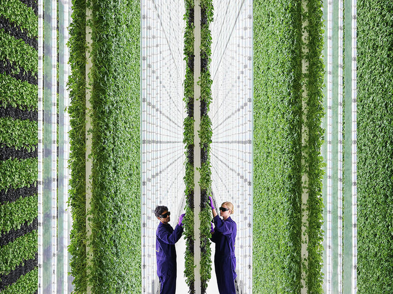
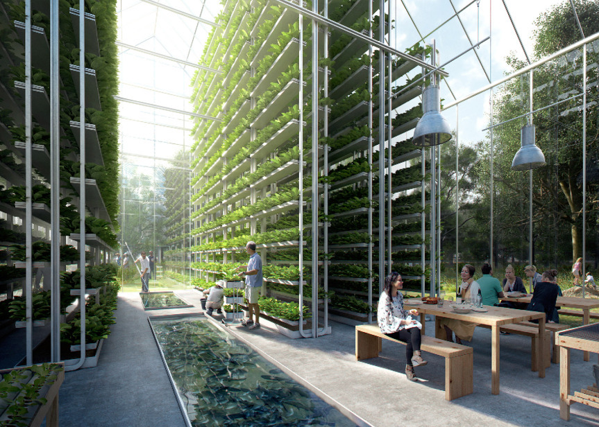
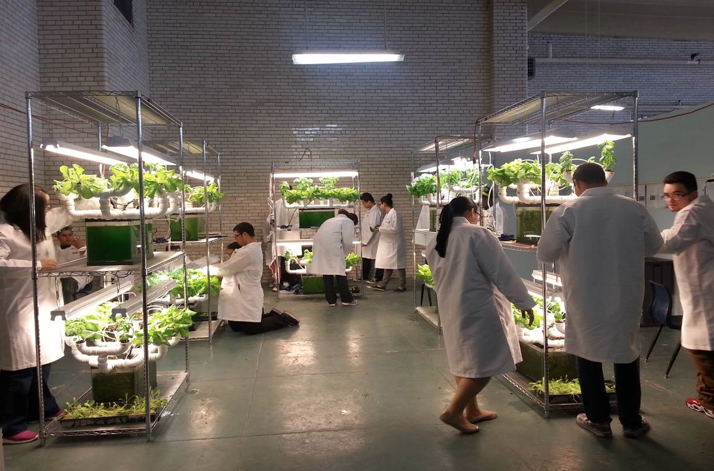
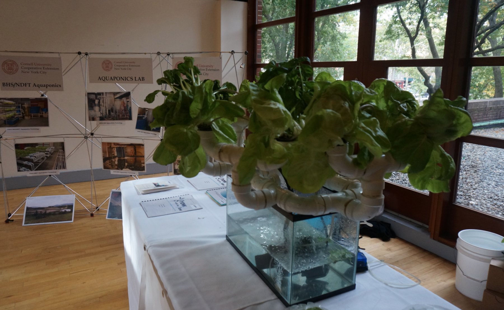

```{r setup, include=FALSE}
knitr::opts_chunk$set(echo = TRUE)
```

## What Do We Do?  


   

Extreme weather events are happening at an increased rate. Farmers cannot afford the cost of crop failures or the long term economic impacts of floods filled with toxic chemicals. Tax payers, who front the cost of agricultural subsidies, also cannot afford the cost of crop failures.  

## Education  
  
  
  
  

* We must fund and direct educational campaigns that work in favor of integrating new technologies into conventional farming practices, and start laying the groundwork for a transition of the labor force.  Prioritize technological literacy.  

* We must further develop research and development centers prioritizing agricultural methodologies which are safeguarded against immediate threats, as well as provide groundwork for future improvements.  

## Funding/Grants  

    


* Local and State governments should discourage traditional farms in Vermont (Especially dairy farms), and redirect funds to new, efficient agricultural methods that can provide for the population and sustain robust economic activity.  


* We cannot continue to direct funding into our current plant production unless it begins to utilize methods of mitigating crop failure risks in the face of climate change.  

* The combination of hydroponics and indoor vertical farming reduces the risk of crop failure. It increases our food security and reduces the burden on tax payers.  

## Conclusion

By switching to these modern, technologically advanced methods of plant production, plants can sustainably feed the world. We relieve pressure on forests and reduce habitat destruction. We give the soil a chance to recover from the toll of traditional agriculture.  
