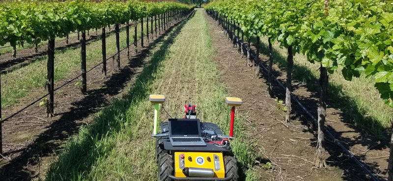
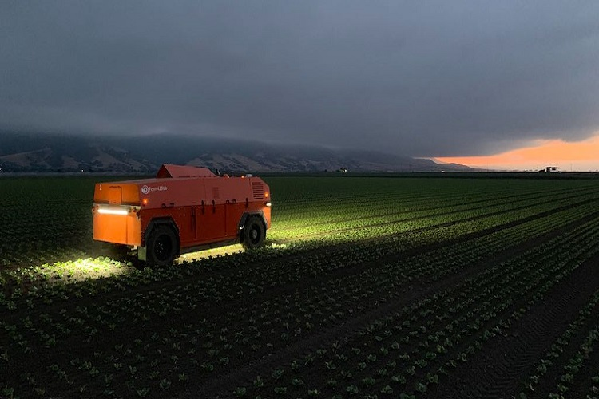

```{r setup, include=FALSE}
knitr::opts_chunk$set(echo = TRUE)
```
Robotics and AI have been instrumental in increasing efficiency in many other industries, and have recently seen an increase in application and investments in farming, both indoor and outdoor.  They provide precise monitoring, decreased labor costs, decreased pathogen spread, and can work at any hour.  In order for our society to meet the food and efficiency demands we are currently (and will be) facing, we must utilize these instruments of power to help balance our ecological checkbook.  

### Current Roles In Agriculture  

* Thinning and Pruning  
* Weeding and Spraying  
* Fertilizing and Irrigation  
* Crop Monitoring and Analysis  
* Crop Seeding  
* Driverless Tractors    


## Indoor Robotics  


### Sananbio Uplift  

   

  

* Unmanned complete growing facility
  - Seeding
  - Germination  
  - Transplanting  
  - Plant Transportation  
  - System cleaning  
  - Harvesting  
  
* Nutrient Solution Tracking/Management  
* Real-time optimization on Water, Electricity, and CO~2~
  


## Outdoor Robotics


#### RAPID (Robot Assisted Precision Irrigation Delivery)  

* Produced by UC Davis, UC Berkeley, UC Merced
* Sponsored by:
  - National Science Foundation  
  - US Department of Agriculture  
* Addresses water dispersal in farming
* Agricultural irrigation consumes 70% of worlds freshwater  
* Retrofits into existing irrigation systems; decreasing cost and burden on farmers
* Being used and tested on Wineries/Orchards in California    

   

   


#### FarmWise Autonomous Weeding Robot  

* Implements AI and Robotic natural synergy
* Helps reduce reliance on chemical weedkillers/inputs
* Preserves integrity of soil  
* Reduces manual labor required to operate farm  
* Weeding is a very strenuous labor job, pressures health care/economic systems  

 

  

#### Beneficial Insect Note  

* Beneficial insects can work, but have downsides in may cases.  
  - Constant food source must be provided  
  - Must be cleaned up after death (Indoor), or can harbor mold/bacteria
  - Sometimes creates auxiliary problems/issues, especially in closed environments

 


