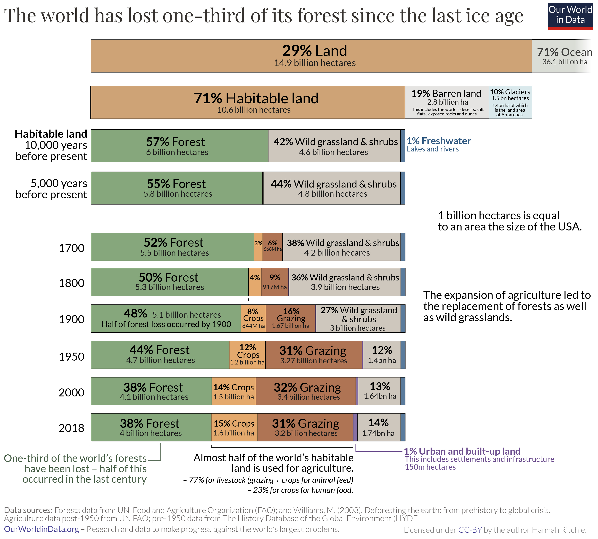

```{r setup, include=FALSE}
knitr::opts_chunk$set(echo = TRUE)
```

## What's Wrong With What We're Doing?    

    

    

    


* Globally, 70% of water usage goes towards agricultural production, largely due to unsustainable irrigation practices. At present, 38% of earth’s non-frozen land is used for growing food.  

* By 2050, it is projected that another 593 million hectares of agricultural land will be needed to meet the projected calorie needs of the global population if we continue with business as usual.  

* Deforestation was found to be the second largest source of anthropogenic carbon dioxide emissions, which is second to the combustion of fossil fuels. As we encroach on the remaining forests, the risk of experiencing even more infectious zoonotic diseases emerges.  

* We can address the massive water use of current agriculture by transitioning to hydroponics, and we can reduce the land footprint required to produce food by utilizing vertical space. These methods also reduce the risk of encountering new, infectious diseases.

### Long Term Forest Loss  

     

* The turn of the 20th century is when global forest loss reached the halfway point: half of total forest loss occurred from 8,000BC to 1900; the other half occurred in the last century alone.  

* By 1900, there were 1.65 billion people in the world (five times fewer than we have today) but for most of the previous period, humans were deforesting the world with only tens or hundreds of millions.   


### Change in Land Use   

   

* In the last 300 years the world lost 1.5 billion hectares of forest over that period. That’s an area 1.5-times the size of the United States.  

* From 1700 to 1850, 19 million hectares were being cleared every decade. That’s around half the size of Germany. From 1850 to 1920, losses were around 50% higher at 30 million hectares per decade.  

* From the 1920s through to the 1980s, decadal losses quadrupled to almost 120 million hectares  

* Global deforestation reached its peak in the 1980s. We lost 150 million hectares  

* Since then, deforestation rates have steadily declined, to 78 million hectares in the 1990s; 52 million in the early 2000s; and 47 million in the last decade  

 

### Identifying Drivers of Loss  

      

* Deforestation is worse than forest degradation  

* Deforestation is the complete removal of trees for agricultural purposes, mining, and urbanization like towns, cities, etc.  

* Just over one-quarter of global forest loss is driven by deforestation. The remaining 73% came from the three drivers of forest degradation: logging of forestry products from plantations (26%); shifting, local agriculture (24%); and wildfires (23%)  


### Deforestation Areas  

   


* 95% of the world’s deforestation occurs in the tropics  

* The world loses almost six million hectares of forest each year to deforestation.  

* Deforestation tends to occur on forests that have been around for centuries, if not millennia. Cutting them down disrupts or destroys established, species-rich ecosystems  

* Agriculture is responsible for 60-80% of deforestation. Habitat loss is the leading driver of biodiversity loss. It is in our best interest to bring deforestation to an end.  


### Organic Issues  

  

* Organic purported to be a serious solution to current sustainability and climate issues  

* 2019 Study from England/Wales models 40% decrease in total food production from switching to Organic from Conventional  

* Replacement foods to meet population demand would come from overseas locations - carbon footprint larger overall  

* Land area needed to make up shortfalls in domestic production would be nearly 5 times current land area usage for England and Wales  

